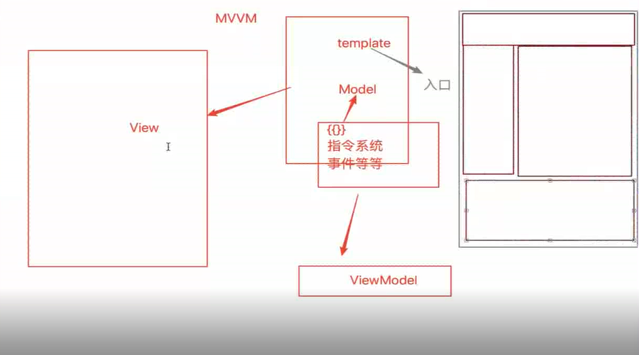

### 准备开始
---


### vue基础

---

#### (1).历史介绍
* angular 09年，年份较早，一开始大家是拒绝  
* react 2013年, 用户体验好，直接拉到一堆粉丝 
* vue 2014年,  用户体验好 

#### (2).前端框架与库的区别?

* jquery 库 -> DOM(操作DOM) + 请求

* art-template 库 -> 模板引擎

* 框架 = 全方位功能齐全

  

  - 简易的DOM体验 + 发请求 + 模板引擎 + 路由功能

* KFC的世界里,库就是一个小套餐, 框架就是全家桶

* 代码上的不同
  - 一般使用库的代码，是调用某个函数，我们自己把控库的代码
  - 一般使用框架，其框架在帮我们运行我们编写好的代码
    - 框架:  初始化自身的一些行为
      - 执行你所编写的代码
      - 施放一些资源

#### (3).vue起步

* 1:引包
* 2:启动 new Vue({el:目的地,template:模板内容});

* options
  * 目的地 el

  * 内容 template

  * 数据 data  保存数据属性

    数据驱动视图


#### vue的文件介绍

#### (4).插值表达式 
* {{ 表达式 }}
  - 对象 (不要连续3个{{ {name:'jack'} }})
  - 字符串 {{ 'xxx' }}
  - 判断后的布尔值  {{  true }}
  - 三元表达式  {{ true?'是正确':'错误'  }}
* 可以用于页面中简单粗暴的调试


* 注意: 必须在data这个函数中返回的对象中声明

#### (5).什么是指令

* 在vue中提供了一些对于页面 + 数据的更为方便的输出,这些操作就叫做指令, 以v-xxx表示
  * 比如html页面中的属性 ```<div v-xxx ></div>```


* 比如在angular中 以ng-xxx开头的就叫做指令
* 在vue中 以v-xxx开头的就叫做指令
* 指令中封装了一些DOM行为, 结合属性作为一个暗号, 暗号有对应的值,根据不同的值，框架会进行相关DOM操作的绑定


#### (6).vue中常用的v-指令演示
* v-text:元素的InnerText属性,必须是双标签 跟{{ }}效果是一样的 使用较少
* v-html: 元素的innerHTML
* v-if : 判断是否插入这个元素,相当于对元素的销毁和创建
* v-else-if
* v-else
* v-show 隐藏元素  如果确定要隐藏,   会给元素的style加上display:none。是基于css样式的切换

```javascript
 v-text 只能用在双标签中
 v-text 其实就是给元素的innerText赋值
 v-html 其实就是给元素的innerHTML赋值
 v-if 如果值为false,会留下一个<!---->作为标记，万一未来v-if的值是true了，就在这里插入元素
 如果有if和else就不需要单独留坑了
 如果全用上  v-if 相邻v-else-if 相邻 v-else 否则 v-else-if可以不用
 v-if和v-else-if都有等于对应的值，而v-else直接写
 v-if家族都是对元素进行插入和移除的操作
 v-show是显示与否的问题
 注意: 指令其实就是利用属性作为标识符,简化DOM操作,
  看：v-model="xxx"
  v-model 代表要做什么  xxx代表针对的js内存对象
  写在那个元素上，就对哪个元素操作

```
#### (7).v-if和v-show的区别 (官网解释)

`v-if` 是“真正”的条件渲染，因为它会确保在切换过程中条件块内的事件监听器和子组件适当地被销毁和重建。

`v-if` 也是**惰性的**：如果在初始渲染时条件为假，则什么也不做——直到条件第一次变为真时，才会开始渲染条件块。

相比之下，`v-show` 就简单得多——不管初始条件是什么，元素总是会被渲染，并且只是简单地基于 CSS 进行切换。

一般来说，`v-if` 有更高的切换开销，而 `v-show` 有更高的初始渲染开销。因此，如果需要非常频繁地切换，则使用 `v-show` 较好；如果在运行时条件很少改变，则使用 `v-if` 较好。

#### (8).v-bind使用

* 给元素的属性赋值  <div id="{{变量}}"></div>
  - 可以给已经存在的属性赋值 input value
  - 也可以给自定义属性赋值 mydata

* 语法 在元素上 `v-bind:属性名="常量||变量名"`

* 简写形式 `:属性名="变量名"`

* ```html
  <div v-bind:原属性名="变量"></div>
  <div :属性名="变量">
      
  </div>
  ```


#### (9).v-on的使用
* 处理自定义原生事件的,给按钮添加click并让使用变量的样式改变
* 普通使用   ```v-on:事件名="表达式||函数名"```
* 简写方式  ``` @事件名="表达式"```

#### 1-9知识点阶段总结

* 如何启动vue  : 1:引包 2:留坑 3:启动(new Vue)   
  * options:  el/template/data函数
* 更便捷的操作DOM及数据  v-xxx指令
  * v-text/v-html/v-if/v-show/v-bind/v-on
  * v-bind绑定属性值
  * v-on绑定事件


#### (10).v-model

* 双向数据流（绑定）
  * 页面改变影响内存(js)
  * 内存(js)改变影响页面

#### (11).v-bind 和 v-model 的区别?
* `input v-model="name"`
  - 双向数据绑定  页面对于input的value改变，能影响内存中name变量
  - 内存js改变name的值，会影响页面重新渲染最新值
* `input :value="name"`
  - 单向数据绑定 内存改变影响页面改变
* v-model: 其的改变影响其他  v-bind: 其的改变不影响其他
* v-bind就是对属性的简单赋值,当内存中值改变，还是会触发重新渲染

#### (12).v-for的使用
* 基本语法 `v-for="item in arr"`
* 对象的操作 `v-for="item in obj"`
* 如果是数组没有id
  * `v-for="(item,index) in arr" :class="index" `
* 各中v-for的属性顺序(了解)
  * 数组 item,index
  * 对象 value,key,index

##### 漂亮的列表
* class 是可变的


#### 关于对象内的this

* vue已经把以前this是window或者事件对象的问题搞定了
* methods和data本身是在同一个对象中的,所以在该对象中可以通过this.随意取
* this.xxx 取data中的值, this.xxxMethod调methods中的函数

#### (13).局部组件的使用

​	渲染组件-父使用子组件

* 1: 创建子组件(对象)
    - `var Header = { template:'模板' , data是一个函数,methods:功能,components:子组件们 } `
* 2: 在父组件中声明,根属性`components:{ 组件名:组件对象 }`
* 3: 在父组件要用的地方使用 `<组件名></组件名>`
    - 在不同框架中,有的不支持大写字母，用的时候
        + 组件名 MyHeader
        + 使用 my-header
* 总结: 有父，声子，挂子，用子

### （14）组件深入
---
#### 父子组件传值(父传子)
* 1:父用子的时候通过属性Prop传递
* 2:子要声明props:['属性名'] 来接收
* 3:收到就是自己的了，随便你用
    - 在template中 直接用
    - 在js中 this.属性名 用
* 总结:父传,子声明,就是子的了
* 小补充: 常量传递直接用，变量传递加冒号
* 


#### 总结父传子

* 父用子     先声子,挂子,用子
* 父传子     父传子(属性),子声明(收),子直接用(就是自己的一样)


#### 注册全局组件
* 应用场景: 多出使用的公共性功能组件，就可以注册成全局组件,减少冗余代码
* 全局API `Vue.component('组件名',组件对象);`

#### 附加功能:过滤器&监视改动
* filter
    * 将数据进行添油加醋的操作
    * 过滤器分为两种
        * 1:组件内的过滤器(组件内有效)
        * 2:全局过滤器(所有组件共享)
    * 先注册,后使用
    * 组件内 `filters:{ 过滤器名:过滤器fn }` 最终fn内通过return产出最终的数据
    * 使用方式是 `{{ 原有数据 | 过滤器名  }}`
    * 需求
        * 页面input框输入字符串, 另一边显示其反转的内容
    * 过滤器fn:
        * 声明`function(data,argv1,argv2...){}`
        * 使用`{{ 数据 | 过滤器名(参数1,参数2) }}`
* watch 监视单个
* computed 监视多个

#### 模块化
* webpack命令
  `npm init -y`
  `npm install webpack@2.2.1 --save-dev --registry https://registry.npm.taobao.org`
* package.json文件
  `"scripts": {
    "test": "webpack ./main.js ./build.js"
  },`
* 命令行运行 `npm run test`

#### ES6模块
* 导入和导出只能存在顶级作用域
* require引入是代码执行的时候才加载
* import 和export 都是提前加载 ，加载在代码执行之前

#### 箭头函数和function
* 一方面箭头函数是种简写形式
* 应用场景: 由于箭头函数本身没有this和arguments，通常用在事件类的回调函数上，让其向上级function绑定this，而非事件对象
* 箭头函数不可以作为构造函数

#### ES6函数简写
* 用在对象的属性中
```javascript
fn3() { //干掉了:function,用在对象的属性中
				console.log(this);
},
```

#### key
* 使用子组件循环输出一堆数据
* 不依赖子组件状态或临时 DOM 状态 (例如：表单输入值) 的列表渲染输出。
* 建议v-for就写，提升性能，避免vue运算,key就是记录元素与dom间的位置关系

```html
<son v-for="(item,index) in persons" :key="index" ></son>
```
#### slot
* slot就是子组件里给DOM留下的坑
* <子组件>DOM</子组件>
* slot动态的DOM、props是动态的数据

#### 组件生命周期
* 需要频繁的创建和销毁组件
  - 比如页面中部分内容显示与隐藏，但是用的是v-if
* 组件缓存
  - 内置组件中<keep-alive>
  - 被其包裹的组件，在v-if=false的时候，不会销毁，而是停用
  - v-if="true" 不会创建,而是激活
  - 避免频繁创建组件对象的性能损耗
* 成对比较
  - created 和 beforeCreate 
    + A 可以操作数据 B 数据没有初始化
  - mounted 和 beforeMount
    + A 可以操作DOM B 还未生成DOM
  - updated 和 beforeUpdate
    + A 可以获取最终数据 B 可以二次修改
  - 频繁销毁创建的组件使用内置组件<keep-alive></keep-alive>包裹

```javascript
	activated(){  //激活的 keep-alive v-if="true"
		console.log('activated')
	},
	deactivated(){  //停用的 keep-alive v-if="false"
		console.log('deactivated')
	},
	beforeDestroy(){ //销毁前 v-if="false"
		console.log('beforeDestroy')
	},
	destroyed(){//销毁后 v-if="false"
		console.log('destroyed')
	},
```

#### 获取DOM元素
* 救命稻草, document.querySelector
* 1: 在template中标识元素 ref="xxxx"
* 2: 在要获取的时候, this.$refs.xxxx 获取元素
  - 创建组件,装载DOM,用户点击按钮

* ref在DOM上获取的是原生DOM对象
* ref在组件上获取的是组件对象
  - $el 是拿其DOM
  - 这个对象就相当于我们平时玩的this,也可以直接调用函数